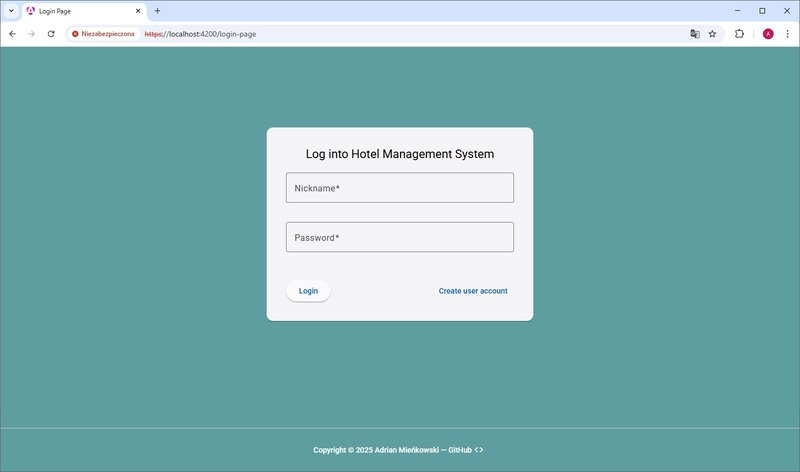
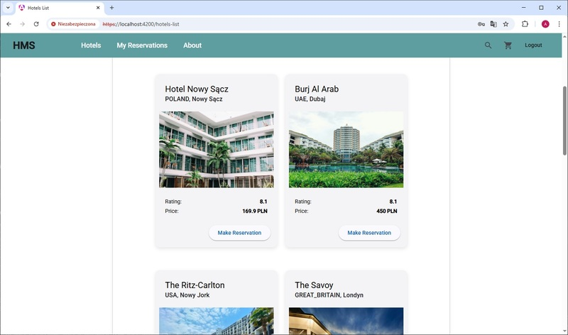
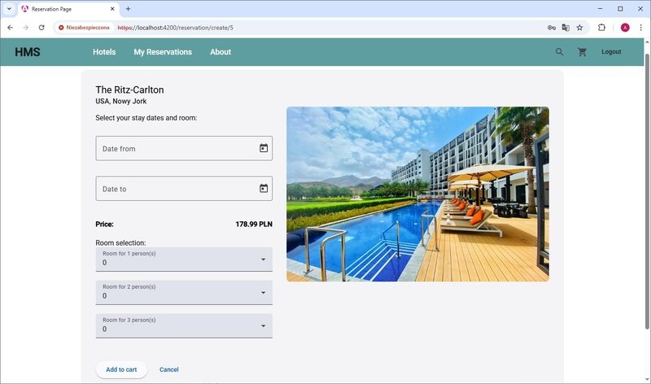
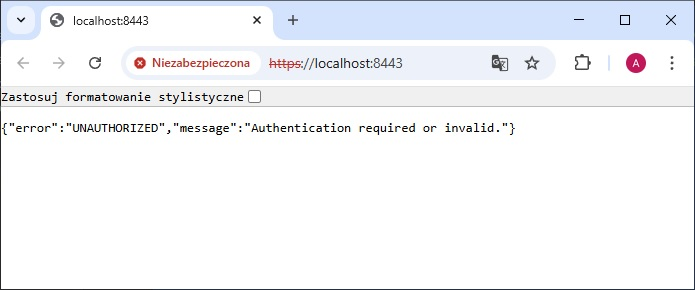

[Readme PL](README.pl.md)

# Hotel Booking App – Backend

**Live demo:** [adrian-mienkowski-booking-app.vercel.app](https://adrian-mienkowski-booking-app.vercel.app)
- login: `demo`
- password: `demo123`

> ℹ️ Note: The backend server may take up to **2 minutes to wake up** after a period of inactivity (free-tier hosting limitation). Please be patient when logging in for the first time.

This is the backend part of a hotel booking application, built with Java 22 using Spring Boot and Spring Security. It handles user authentication, listing hotels, and displaying hotel details. JWT-based authentication is used, where the **access token stored in `localStorage`** and the **refresh token stored in an `httpOnly` cookie**. Local deployment is simplified by a `docker-compose` setup with a PostgreSQL image.

<p align="center">
  
</p>
<p align="center">
  
  
</p>

## Installation and running

**Requirements:**
- Java 22
- Docker

To enable user authentication, make sure:
- the frontend is running: [hms-frontend](https://github.com/ArdianM90/hms-frontend)
- the `keystore.p12` file is present in `./src/main/resources`

To generate the `keystore.p12` file, run:
```bash
keytool -genkeypair -alias mysslkey -keyalg RSA -keysize 2048 \
     -storetype PKCS12 -keystore keystore.p12 -validity 3650 \
     -storepass changeit
```

**Build and run the application:**
```bash
docker-compose up --build
```

By default, the application runs at: [https://localhost:8443](https://localhost:8443)

<p align="center">
  
</p>

## Technologies Used
- Java 22 - main backend language
- Spring Boot 3.5 – web application framework
- Spring Security – handles user authentication and authorization
- Spring Data JPA – data persistence with Hibernate
- PostgreSQL – relational database (runs locally via Docker container)
- JWT (JSON Web Tokens) – authentication system (access token in localStorage, refresh token in httpOnly cookie)
- JJWT – JWT processing library
- Maven – project build and dependency management
- Docker / Docker Compose – containerization of the app and the database
- [Render](https://render.com//) – backend hosting

## REST API – available endpoints
### Authentication (AuthenticationController.java)

| Method | Endpoint              | Description       | Authorization                   |
|--------|-----------------------|-------------------|---------------------------------|
| POST   | /hms/v1/auth/login    | User login        | no                              |
| POST   | /hms/v1/auth/logout   | User logout       | no                              |
| POST   | /hms/v1/auth/refresh  | Refresh JWT token | refresh token (httpOnly cookie) |

### Hotel listing (HotelListController.java)

| Method | Endpoint           | Description              | Authorization               |
|--------|--------------------|--------------------------|-----------------------------|
| GET    | /hms/v1/hotel/{id} | Get hotel details by ID  | access token/ refresh token |
| GET    | /hms/v1/hotels     | Get a list of all hotels | access token/ refresh token |

## Planned Features (Work in Progress):
- user registration,
- hotel booking functionality (user can create a reservation).
