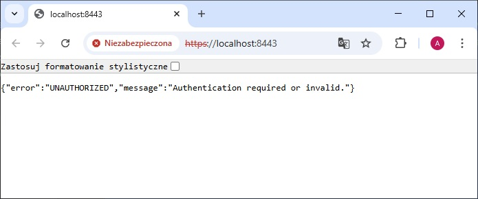

[Readme ENG](README.md)

# Hotel Booking App – Backend

**Zobacz online:** [adrian-mienkowski-booking-app.vercel.app](https://adrian-mienkowski-booking-app.vercel.app)
- login: `demo`
- hasło: `demo123`

> ℹ️ Uwaga: Serwer backendu może potrzebować do 2 minut na „rozbudzenie się” po kilkunastu minutach bezczynności (ograniczenia darmowego hostingu). Proszę o cierpliwość przy pierwszym logowaniu.

Backendowa część aplikacji do rezerwacji hoteli, napisana w Java 22 z użyciem Spring Boot/Spring Security. Obsługuje logowanie użytkownika, wyświetlanie listy hoteli oraz szczegółów wybranego hotelu. Wykorzystuje uwierzytelnianie oparte na JWT, przy czym **access token jest przechowywany w `localStorage`**, a **refresh token w `httpOnly` cookie**. Lokalny deploy aplikacji ułatwiony dzięki przygotowanej konfiguracji docker-compose z obrazem PostgreSQL. 

<p align="center">
  
</p>
<p align="center">
  
  
</p>

## Instalacja i uruchomienie

**Wymagania:**
- Java 22
- Docker

**Zmienne środowiskowe**

Przed uruchomieniem aplikacji upewnij się, że zdefiniowałeś następujące zmienne środowiskowe, np. w pliku .env lub eksportując je w swojej powłoce:
- `PG_USERNAME` – nazwa użytkownika PostgreSQL
- `PG_PASSWORD` – hasło do PostgreSQL
- `JWT_SECRET` – sekret do generowania tokenów JWT (biblioteka jjwt wymaga ciągu znaków o długości co najmniej 32 znaków dla algorytmu HS256)

Do prawidłowego działania logowania wymagane są:
- uruchomiony frontend: [przejdź do repozytorium](https://github.com/ArdianM90/hms-frontend)
- wygenerowany plik `keystore.p12` w `./src/main/resources`

Plik `keystore.p12` można wygenerować poleceniem:
```bash
keytool -genkeypair -alias mysslkey -keyalg RSA -keysize 2048 \
     -storetype PKCS12 -keystore keystore.p12 -validity 3650 \
     -storepass changeit
```

**Budowanie i uruchamianie projektu:**
```bash
docker-compose up --build
```

Domyślnie aplikacja uruchamia się pod adresem: [https://localhost:8443](https://localhost:8443)
<p align="center">
  
</p>

## Technologie
- Java 22 - główny język backendu
- Spring Boot 3.5 – framework do tworzenia aplikacji webowych
- Spring Security – obsługa uwierzytelniania użytkownika
- Spring Data JPA – integracja z bazą danych przy użyciu Hibernate
- PostgreSQL – relacyjna baza danych (uruchamiana lokalnie w kontenerze Docker)
- JWT (JSON Web Tokens) – autentykacja (access token w localStorage, refresh token w httpOnly cookie)
- JJWT – biblioteka do obsługi tokenów JWT
- Maven – system budowania projektu i zarządzania zależnościami
- Docker / Docker Compose – konteneryzacja aplikacji oraz bazy danych
- [Render](https://render.com//) – hosting backendu

## REST API – dostępne endpointy
### Autentykacja (AuthenticationController.java)

| Metoda | Endpoint              | Opis                     | Autoryzacja                     |
|--------|-----------------------|--------------------------|---------------------------------|
| POST   | /hms/v1/auth/login    | Logowanie użytkownika    | nie                             |
| POST   | /hms/v1/auth/logout   | Wylogowanie użytkownika  | nie                             |
| POST   | /hms/v1/auth/refresh  | Odświeżenie tokena JWT   | refresh token w httpOnly cookie |

### Lista hoteli (HotelListController.java)

| Metoda | Endpoint           | Opis                         | Autoryzacja                 |
|--------|--------------------|------------------------------|-----------------------------|
| GET    | /hms/v1/hotel/{id} | Szczegóły konkretnego hotelu | access token/ refresh token |
| GET    | /hms/v1/hotels     | Pobranie listy hoteli        | access token/ refresh token |

## Planowane następne kroki rozwoju aplikacji:
- rejestracja nowych użytkowników
- możliwość składania rezerwacji przez użytkowników
